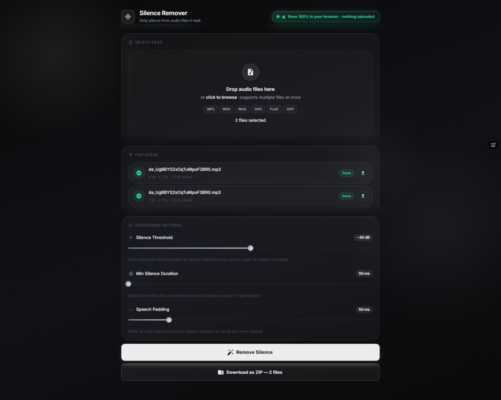

# Silence Remover 🎧🎬


A professional, high-performance web application designed to automatically detect and remove silent parts from both **audio** and **video** files. Built with a **privacy-first** approach, 100% of processing runs locally in your browser—your media never leaves your device.

---

## 📸 Preview



---

## ✨ Key Features

### 🔒 100% Privacy & Security
- **Zero Cloud Uploads:** Audio decoding, video cutting, and file generation take place entirely client-side using Web Audio API and WebAssembly (FFmpeg WASM).
- **Offline Capable:** Works seamlessly offline once loaded in your browser.

---

### 🎵 Tab 1: Audio Silence Remover
- **⚡ Bulk Audio Processing:** Upload single or multiple audio files simultaneously.
- **📊 Real-time Waveform Visualization:** View original and trimmed waveform data.
- **🛠️ Precision Silence Parameters:**
  - **Silence Threshold (dB):** Custom decibel limit defining silence vs speech.
  - **Minimum Silence Length (ms):** Filter out quick natural pauses.
  - **Padding (ms):** Add buffer around speech to avoid audio clipping.
- **📦 Smart Export:** Download individual trimmed `.wav` files or export the entire queue as a `.zip` archive.
- **🌐 Supported Formats:** `MP3`, `WAV`, `M4A`, `OGG`, `FLAC`, `AIFF`.

---

### 🎬 Tab 2: Video Silence Remover
- **🎞️ Batch Video Trimming:** Process single clips or entire batches of video files.
- **🔍 Interactive Region Inspector:**
  - **Wavesurfer Waveform:** Visual overlay marking silences (Red) and kept speech (Gray).
  - **Click-to-Jump:** Click any silent region on the waveform to sync video player playback.
  - **Segment Checkboxes:** Easily toggle individual silent segments on or off.
- **⚡ Frame-Accurate FFmpeg WASM Engine:**
  - Fast stream-copy and zero-latency H.264 video trimming.
  - Automatic fallback re-encoding for complex containers and non-monotonous DTS timestamps.
- **📦 Video Export:** Download individual `.mp4` files or package the whole batch into a `.zip` file.
- **🌐 Supported Formats:** `MP4`, `MOV`, `WEBM`, `MKV`, `AVI`.

---

## 🚀 Tech Stack

- **Core Framework:** [React 18](https://react.dev/) + [Vite](https://vitejs.dev/)
- **UI Design System:** [Material UI (MUI v6)](https://mui.com/) with Custom Dark Glassmorphism
- **Video Engine:** [`@ffmpeg/ffmpeg`](https://github.com/ffmpegwasm/ffmpeg.wasm) 0.12 (WebAssembly Core)
- **Audio Engine:** Browser Web Audio API (`AudioContext`, PCM Synthesis)
- **Waveforms:** [`wavesurfer.js`](https://wavesurfer.js.org/) v7 with Regions plugin
- **Archiving:** [`JSZip`](https://stuk.github.io/jszip/) for client-side ZIP packaging

---

## 🛠️ Getting Started

### Prerequisites

- [Node.js](https://nodejs.org/) (v18 or higher recommended)
- `npm` or `pnpm`

### Installation

1. **Clone the repository:**
   ```bash
   git clone https://github.com/PramudithaN/silence-remover.git
   cd silence-remover
   ```

2. **Install dependencies:**
   ```bash
   npm install
   ```

3. **Start the development server:**
   ```bash
   npm run dev
   ```

4. **Build for production:**
   ```bash
   npm run build
   ```

---

## 📖 How to Use

1. **Select Mode:** Choose **Audio Silence Remover** or **Video Silence Remover** using the top tab bar.
2. **Upload:** Drag & drop your media files into the drop zone.
3. **Inspect & Tweak:**
   - For **Audio**: Adjust Threshold, Min Silence, and Padding sliders.
   - For **Video**: Review detected silent zones on the interactive waveform, click regions to jump playback, and adjust sliders if needed.
4. **Process:** Click **Remove Silence** (Audio) or **Cut All Videos** (Video).
5. **Download:** Export individual processed files or download everything as a `.zip` archive.

---

## 📜 License

This project is open source and available under the [MIT License](LICENSE).

---

## 🙋‍♂️ Connect with Me

- **GitHub**: [github.com/PramudithaN](https://github.com/PramudithaN)
- **LinkedIn**: [linkedin.com/in/pramuditha-nadun-612b1b204](https://www.linkedin.com/in/pramuditha-nadun-612b1b204)
- **Email**: pramudithanadun@gmail.com

---

*Developed with ❤️ by Pramuditha Nadun.*

